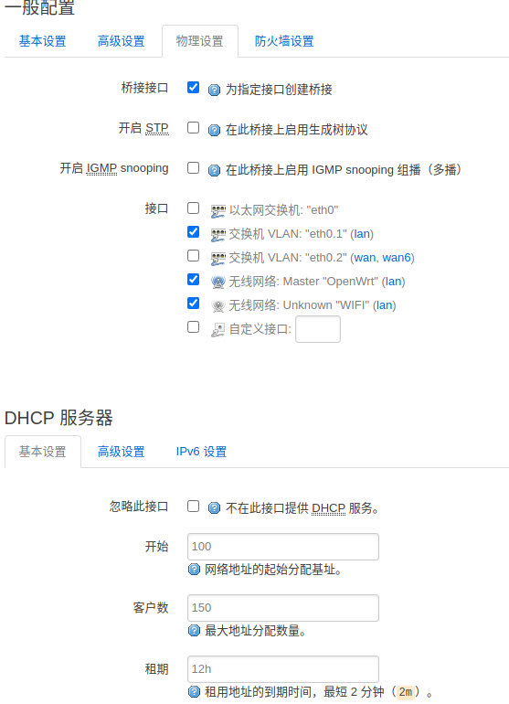

---
title: ""
draft: false
tags: ["first"]
author: "liukanglai"
# author: ["Me", "You"] # multiple authors
showToc: true
TocOpen: false
hidemeta: false
comments: false
description: "Desc Text."
canonicalURL: "https://canonical.url/to/page"
disableHLJS: true # to disable highlightjs
disableShare: false
disableHLJS: false
hideSummary: false
searchHidden: true
ShowReadingTime: true
ShowBreadCrumbs: true
ShowPostNavLinks: true
ShowWordCount: true
ShowRssButtonInSectionTermList: true
UseHugoToc: true
cover:
    image: "<image path/url>" # image path/url
    alt: "<alt text>" # alt text
    caption: "<text>" # display caption under cover
    relative: false # when using page bundles set this to true
    hidden: true # only hide on current single page
editPost:
    URL: "https://github.com/<path_to_repo>/content"
    Text: "Suggest Changes" # edit text
    appendFilePath: true # to append file path to Edit link
---# package

```
- 再安装一些必需的package，官方源下载太慢，需要换国内源：
- vim /etc/opkg/distfeeds.conf:

src/gz openwrt_core http://mirrors.tuna.tsinghua.edu.cn/openwrt/releases/19.07.2/targets/ramips/mt7620/packages
src/gz openwrt_kmods http://mirrors.tuna.tsinghua.edu.cn/openwrt/releases/19.07.2/targets/ramips/mt7620/kmods/4.14.171-1-18384755d38fc43c447d83d4a3e07054
src/gz openwrt_base http://mirrors.tuna.tsinghua.edu.cn/openwrt/releases/19.07.2/packages/mipsel_24kc/base
src/gz openwrt_luci http://mirrors.tuna.tsinghua.edu.cn/openwrt/releases/19.07.2/packages/mipsel_24kc/luci
src/gz openwrt_packages http://mirrors.tuna.tsinghua.edu.cn/openwrt/releases/19.07.2/packages/mipsel_24kc/packages
src/gz openwrt_routing http://mirrors.tuna.tsinghua.edu.cn/openwrt/releases/19.07.2/packages/mipsel_24kc/routing
src/gz openwrt_telephony http://mirrors.tuna.tsinghua.edu.cn/openwrt/releases/19.07.2/packages/mipsel_24kc/telephony

```


# 192.168.1.1

> ssh root@192.168.1.1

1. 若ssh不能登录：

    - telnet


# ifconfig-

端口：

```
lo         虚拟设备端口，自身回环设备，一般指向 127.0.0.1
ra0 rai0   成对出现，无线设备，对应各自的 SSID，分别是 2.4G 和 5G
pppoe-wan  虚拟设备，常见的拨号宽带上网
eth0       物理网卡， eth0.1 或者 eth0.2 都是从此设备虚拟而出。
br-lan     虚拟设备，用于 LAN 口设备桥接，用来使多个虚拟或物理网络接口的行为好像他们仅有一个网络接口一样。目前路由器普遍将有线 LAN 口（一般四个）和 WIFI 无线接口桥接在一起作为统一的 LAN。可以使用 brctl show 来查看使用情况。
eth1       如果路由器有两块网卡，一般 eth1 作为 WAN 口
wlan0      一般是无线网卡，无线端口
wlan1      另一块无线网卡
```
> br-lan = eth0.1 + rai0 + ra0，即将有线 LAN 口和无线网统一划分为 LAN。

- LAN 是设置局域网内的相关属性，可以设置内网的 IP，桥接的端口。比如我们默认使用 192.168.1.1 访问，可以修改为 192.168.9.1，生效后内网分配的 ip 网段就会变成 192.168.9.x 。LAN 口的协议为【静态地址】


# language 

找到 luci-i18n-base-zh-cn 点击前面的安装。然后去设置语言即可。

# Internet

编辑 /etc/config/network 中关于wan的配置


config 'interface' 'wan'

option 'ifname' 'eth1'

option 'proto' 'pppoe'

option 'username' 'xxxxxxxxxx'   （xxxxxxx表示是pppoe帐号，一般不区分大小写）

option 'password' 'xxxxxxxxxx'    （xxxxxx表示是你的密码）

option 'peerdns' '1'

option 'defaultroute' '1'

- Interface 

    > add WAN
    >
    > 选择 DHCP（从外网自动获取 ip 地址），静态 ip 或者 PPPoE 拨号即可。
    > 
    > firewall settings- select wan
    >
    > Lan-physical 
    
    


# ipv6

`https://github.com/tuna/ipv6.tsinghua.edu.cn/blob/master/openwrt.md`

