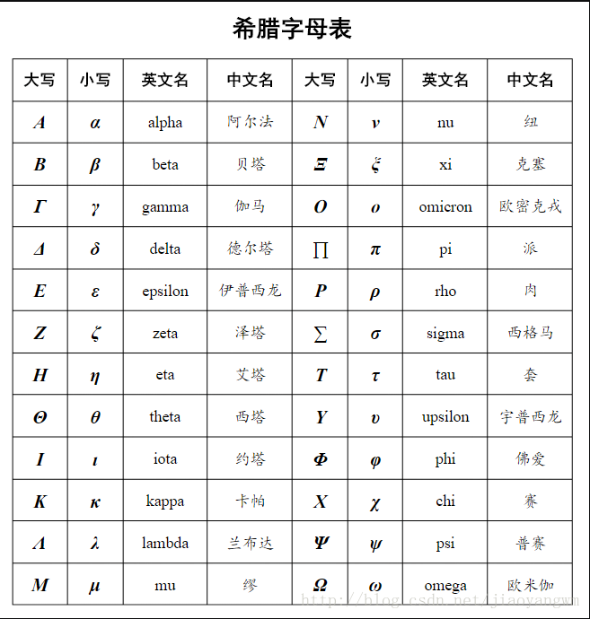

---
title: ""
draft: false
tags: ["first"]
author: "liukanglai"
# author: ["Me", "You"] # multiple authors
showToc: true
TocOpen: false
hidemeta: false
comments: false
description: "Desc Text."
canonicalURL: "https://canonical.url/to/page"
disableHLJS: true # to disable highlightjs
disableShare: false
disableHLJS: false
hideSummary: false
searchHidden: true
ShowReadingTime: true
ShowBreadCrumbs: true
ShowPostNavLinks: true
ShowWordCount: true
ShowRssButtonInSectionTermList: true
UseHugoToc: true
cover:
    image: "<image path/url>" # image path/url
    alt: "<alt text>" # alt text
    caption: "<text>" # display caption under cover
    relative: false # when using page bundles set this to true
    hidden: true # only hide on current single page
editPost:
    URL: "https://github.com/<path_to_repo>/content"
    Text: "Suggest Changes" # edit text
    appendFilePath: true # to append file path to Edit link
---# 符号

> 支持两种方式: \$...$ or \&...;

&mid;
&cdot;
&circ;
&ast;
&bigodot;
&bigotimes;

## 数学符号（$\log$）

1. 上下标

- $a^b$ 上标
- $a_b$ 下标

2. 分数

\frac{ }{ }
- 第一个{ }写分子，第二个{ }写分母。
$\frac{3+8a}{5b+6}$

- 二元运算符

加减 $\pm$

点乘 $\cdot$

乘 $\times$

除 $\div$

名称 | 数学表达式 | markdown公式
-|-|-
求和号 | $\sum{3x^n}$
带范围求和 | $\sum_{n=1}^N{3x^n}$
求和号 | $\prod{3x^n}$
带范围求乘 | $\prod_{n=1}^N{3x^n}$
开方号 | $\sqrt[5]{100}$
积分 ∫51f(x)dx∫15f(x)dx $\int^5_1{f(x)}{\rm d}x$
二重积分 ∬51f(x)dx∬15f(x)dx $\iint^5_1{f(x)}{\rm d}x$
三重积分 ∭51f(x)dx∭15f(x)dx $\iiint^5_1{f(x)}{\rm d}x$
正无穷 $+\infty$
负无穷 $-\infty$

左箭头 limn→+∞nlimn→+∞n $\lim_{n\rightarrow+\infty} n$

- 微积分运算

y{\prime}x \int \iint \iiint \oint \lim \infty \nabla

- 关系运算符

大于等于 $\geq$

小于等于 $\leq$

不等于 $\not=$

不小于 $\not$

约等于 &approx;
恒等于 &equiv;
大于符号 &gt;
小于符号 &lt;
不等于符号 &ne;

- 对数运算符

对数 loglog $\log$

对数 log218log2⁡18 $\log_2{18}$

对数 lnln $\ln$

- 三角运算符

\bot \angle 30^\circ \sin \cos \tan \cot \sec \csc

垂直 ⊥⊥ $\bot$

角 ∠∠ $\angle $

30度角  $30^\circ$

正弦  $\sin$

余弦 $\cos$

正切 $\tan$

左箭头 $\leftarrow$

右箭头 $\rightarrow$

长箭头 $\longrightarrow$

上箭头 $\uparrow$

下箭头 $\downarrow$

# 集合运算

⊃ &supset;
⊇ &supseteq;

⊂ &subset;
⊆ &subseteq;

∈ &in;
∉ &notin;

空集 &emptyset; &emptyset;

⋂ &bigcap;

⋃ &bigcup;

⋁  &bigvee;

⋀  &bigwedge;

⨆ &bigsqcup;

∏ &prod;

∐ &coprod;

&biguplus;

- 逻辑运算

∵ &because; 

∴ &therefore; 

∀ &forall; 

∃ &exist;

- 箭头

\uparrow \downarrow \leftarrow \rightarrow \Uparrow \Downarrow \Leftarrow \Rightarrow \longleftarrow \longrightarrow \Longleftarrow \Longrightarrow

- 连线

\overline{a+b+c+d}

\underline{a+b+c+d}

\overbrace{a+\underbrace{b+c}_{1.0}+d}^{2.0}

\hat{y} \check{y} \breve{y}

# 

        ” 双引号 \&quot;
        
        × 乘号 \&times;
        
        ← 向左箭头 \&larr;
        
        & AND符号 \&amp;
        
        ÷ 除号 \&divide;
        
        ↑ 向上箭头 \&uarr;
        
        ± 正负符号 \&plusmn;
        
        → 向右箭头 \&rarr;
        
        ↓ 向下箭头 \&darr;
        
          空格 \&nbsp;
        
        √ 根号 \&radic;
        
        ↑ 双向箭头 \&harr;
        
        ?  倒问号 \&iquest;
        
        ∞ 无限大符号 \&infin;
        
        ⇐ 双线向左箭头 \&lArr;
        
        ?  双左箭头 \&laquo;
        
        ∠ 角度符号 \&ang;
        
        ⇑ 双线向上箭头 \&uArr;
        
        ?  双右箭头 \&raquo;
        
        ∫ 微积分符号 \&int;
        
        ⇒ 双线向右箭头 \&rArr;
        
        ‘ 左单引号 \&lsquo;
        
        ° 度数符号 \&deg;
        
        ⇓ 双线向下箭头 \&dArr;
        
        ’ 右单引号 \&rsquo;
        
        ⇔ 双线双向箭头 \&hArr;
        
        “ 左双引号 \&ldquo;
        
        ♠ 黑桃符号 \&spades;
        
        ” 右双引号 \&rdquo;
        
        ♣ 梅花符号 \&clubs;
        
        ¶ 段落符号 \&para;
        
        ≥ 大于等于符号 \&ge;
        
        ♥ 红心符号 \&hearts;
        
        § 章节符号 \&sect;
        
        ⊥ 垂直符号 \&perp;
        
        ♦ 方块符号 \&diams;
        
        © 版权所有符号 \&copy;
        
        ∴ 所以符号 \&there4;
        
        …  \&hellip; 
        
        ® 注册商标符号 \&reg;
        
        1 批注1符号 \&sup1; 
        
        2 批注2符号,平方 \&sup2; 
        
        ™ 商标符号 \&trade;
        
        γ Gamma符号 \&gamma;
        
        € 欧元符号 \&euro;
        
        ￠ 美分符号 \&cent;
        
        ‰ 千分符号 \&permil;
        
        ￡ 英镑符号 \&pound;
        
        ￥ 日圆符号 \&yen; 

        ⊕ \&oplus;

# 字母

- ƒ \&fnof;
- 大写: 首字母大写即可

